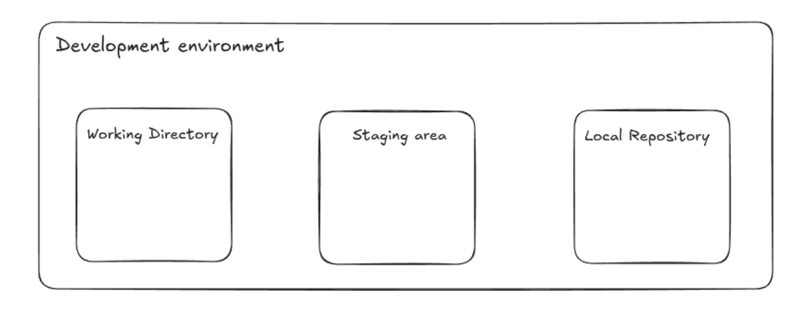

# Part 1: Repositoris locals

## Què és un repositori local?

Un repositori local és una carpeta al vostre ordinador on Git emmagatzema tots els fitxers i la informació sobre el vostre projecte. Cada repositori conté un historial complet de tots els canvis que heu fet, així com les branques i etiquetes associades al projecte.

