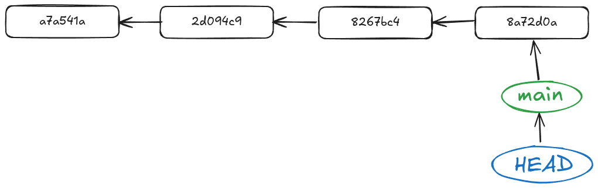
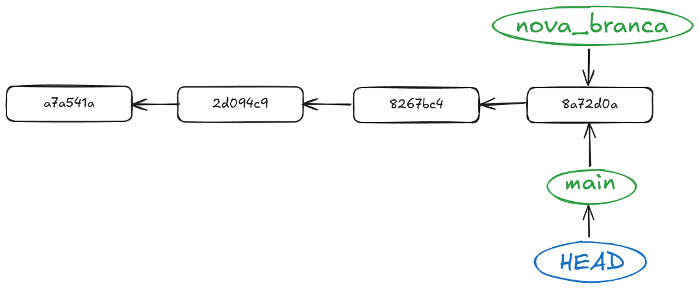

# Part 2: Crear branques i fusionar-les

## Què és una branca?

Per entendre què és una branca, pensem en un arbre. La branca principal és la branca `master` o `main`, i les altres branques són com les branques secundàries que surten d'aquesta. Cada branca pot tenir el seu propi conjunt de canvis, i podem fusionar-les quan sigui necessari.

Anem a afegir un paràmetre més a la comanda `git log` per veure les branques de cada commit. Executa la següent comanda:

```bash
git log --oneline --graph --decorate
```

Vorem que l'eixida de la comanda varia un poc respecte a la que hem vist abans.

```bash
* 8a72d0a (HEAD -> main) més canvis al README
* 8267bc4 nous canvis al README
* 2d094c9 canvis al README
* a7a541a Afegit README.md
```

Anem a aprofundir en este esquema, i ho pintarem diferent per entendre el concepte de commit i de branca. Este diagrama és el que a mi em va fer canviar totalment la concepció de Git i em va fer clic per entendre com funciona.



En este diagrama podem observar que cada commit és un punt en el temps, i cada branca és una línia que representa el desenvolupament del projecte. Es important entendre que les branques no són més que punters que apunten a un commit concret en el temps. Això vol dir que cada vegada que fem un commit, estem creant un nou punt en el temps.

Eixos punts en el temps ens permetran tornar enrere en el temps i veure com era el projecte en un moment concret. Això és molt útil si volem desfer canvis.

## Crear una nova branca

Per crear una nova branca, podem utilitzar la comanda `git branch`. Aquesta comanda ens permet crear una nova branca a partir de la branca actual. Per exemple, si volem crear una nova branca anomenada `nova-branca`, podem executar la següent comanda:

```bash
git branch nova-branca
```

Amb esta comanda el que fem és crear un nou punter que apunta al commit actual.



Però fixeu-vos en `HEAD`, què és això? `HEAD` és un punter que indica la branca en la que ens troben actualment. En este cas, `HEAD` apunta a la branca `main`, que és la branca principal del nostre repositori. Si volem canviar a la nova branca que acabem de crear, podem utilitzar la comanda `git checkout`:

```bash
git checkout nova-branca
```


## Diversificació de camins en l'historial

En l'estat anterior, tenim les dues branques apuntant al mateix commit, però ara la màgia de Git comença a passar. Si fem un commit en la nova branca, el commit es guardarà en la nova branca i no afectarà la branca `main`. Això és el que ens permet treballar en diferents funcionalitats alhora sense interferir en el treball dels altres. Des de la branca `nova-branca` fes canvis en el projecte i commiteja'ls.

```bash
git commit -m "Canvis en la nova branca"
```

Feu un git log amb els paràmetres anteriors per veure com queda l'historial. Ara veureu que la branca `nova-branca` té un commit nou que no està present en la branca `main`.

```bash
* 2e4ef06 (HEAD -> nova_branca) Canvis en la nova branca
* 8a72d0a (main) més canvis al README
* 8267bc4 nous canvis al README
* 2d094c9 canvis al README
* a7a541a Afegit README.md
```

Si analitzem el log i el tranformem en diagrama tindriem algo així:


Ara tenim dues branques que divergeixen, i cada una té el seu propi conjunt de commits. Això és el que ens permet treballar en paral·lel sense interferir en el treball dels altres.

## Fusionar branques

Ara que tenim dues branques, és hora de fusionar-les. La fusió de branques és el procés d'unir dues branques en una sola. Això és útil quan hem acabat de treballar en una funcionalitat i volem integrar-la a la branca principal.

Per fusionar dues branques, primer hem de canviar a la branca en la qual volem fusionar els canvis. En este cas, volem fusionar els canvis de la branca `nova-branca` a la branca `main`. Per fer-ho, primer canviem a la branca `main` amb la comanda següent:

```bash
git checkout main
```

Ara, el nostre `HEAD` apunta a la branca `main`.


Ara podem fusionar els canvis de la branca `nova-branca` a la branca `main` amb la comanda següent:

```bash
git merge nova-branca
```

El que estem fent ací, en realitat, és moure el punter `HEAD` de la branca `main` al commit de la branca `nova-branca`. Això és el que ens permet integrar els canvis de la nova branca a la branca principal.

Este tipus de merge s'anomena "fast-forward merge", i és el més comú quan les dues branques no han divergit. És la casuḯstica més senzilla i no genera conflictes, ja que no hi ha canvis en la branca `main` que puguin entrar en conflicte amb els canvis de la branca `nova-branca`.


## Fusionar branques divergents

Ara anem a complicar un poc les coses. Posem per cas que nosaltres estem fent canvis en la nostra branca `nova_branca`, anem a modificar l'arxiu README.md i afegir un nou paràgraf. Ara, si fem un commit, tindrem un nou commit en la branca `nova_branca` que no està present en la branca `main`.

```bash
git commit -m "Afegit un nou paràgraf al README"
```

Ara, canviem a la branca `main` i fem un canvi en el README.md, afegint un altre paràgraf en el mateix lloc on hem afegit el paràgraf anterior. Ara, si fem un commit, tindrem un nou commit en la branca `main` que no està present en la branca `nova_branca`.

```bash
git commit -m "Afegit un nou paràgraf al README en la branca main"
```

Si analitzem el log, veurem que ara tenim dues branques que han divergit i tenen canvis en el mateix lloc. Esta volta anem a executar el log amb un paràmetre més per veure la diferència entre les dues branques:

```bash
git log --oneline --graph --decorate --all
```

I vorem que les nostres dues branques han divergit i seguixen camins diferents:

```bash
* 8e24c61 (HEAD -> main) Afegit un nou paràgraf al README en la branca main
| * e28aafd (nova_branca) Afegit un nou paràgraf al README
|/  
* 2e4ef06 Canvis en la nova branca
* 8a72d0a més canvis al README
* 8267bc4 nous canvis al README
* 2d094c9 canvis al README
* a7a541a Afegit README.md
```

Si analitzem el log i el tranformem en diagrama tindriem algo així:


Ara tenim dues branques que han divergit i tenen canvis en el mateix lloc. Si intentem fusionar les dues branques, Git no sabrà quin canvi escollir i ens donarà un error de fusió. Això és el que es coneix com a "conflicte de fusió". Això no ens ha d'espantar, si no que és una part normal del treball amb Git. Els conflictes de fusió són comuns quan treballem en equip i diverses persones fan canvis en el mateix fitxer al mateix temps. Primer anem a fer el merge de les branques:

```bash
git merge nova-branca
```

Encara que ens marque el conflicte, Git ens permet resoldre els conflictes de fusió manualment. Quan fem un merge i hi ha un conflicte, Git marcarà els fitxers afectats amb un missatge d'error i ens indicarà quins fitxers tenen conflictes. Podem obrir els fitxers afectats i veure les línies en conflicte, que estaran marcades amb `<<<<<<<`, `=======` i `>>>>>>>`.

Això ens permetrà veure quins canvis hi ha en cada branca i decidir quins canvis volem conservar. Un cop haguem resolt els conflictes, podem afegir els fitxers afectats a l'staging area i fer un commit per completar la fusió.

```bash
git commit -am "Fusió de nova-branca a main"
```

Anem a analitzar com queda tot plegat un cop hem fusionat les dues branques divergents. Tornem a fer un git log amb tots els paràmetres anteriors i veurem que ara tenim un commit nou que representa la fusió de les dues branques:

```bash
*   b8f513e (HEAD -> main) Fusió de nova_branca en main
|\  
| * e28aafd (nova_branca) Afegit un nou paràgraf al README
* | 8e24c61 Afegit un nou paràgraf al README en la branca main
|/  
* 2e4ef06 Canvis en la nova branca
* 8a72d0a més canvis al README
* 8267bc4 nous canvis al README
* 2d094c9 canvis al README
* a7a541a Afegit README.md
```

I si analitzem el diagrama, tindrem algo semblant al següent:


Un cop an fusionades les dues branques, podem eliminar la branca `nova_branca` si ja no la necessitem. Per fer-ho, podem utilitzar la comanda següent:

```bash
git branch -d nova_branca
```
