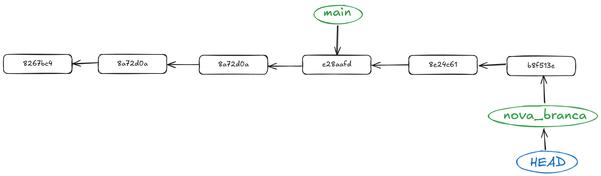

# Part 6: Modificar l'historial de commits

## Context

Quan ja tingueu certa soltura amb Git voldreu que el vostre historial de commits estiga el més net i clar possible, com hem vist en totes les parts anteriors, quan comenceu a toquetejar, fer branques, pull requests, merges i demés, l'arbre de commits comença a complicar-se. Per este tipus de situacions comptem amb algunes comandes que ens permeten arreglar un poc l'historial de commits. Anem a vore què podem fer amb elles.

## Evitar un merge amb conflictes

Quan fem un merge entre dues branques, si hi ha canvis en els mateixos arxius, Git no sabrà quin canvi aplicar i ens demanarà que decidim quina versió volem conservar. Si volem evitar això, podem fer un rebase de la branca que volem fusionar amb la branca principal. Això farà que els commits de la branca que volem fusionar es reescriguen sobre la branca principal, evitant així els conflictes.


Per fer un rebase, primer hem de situar-nos a la branca que volem fusionar i després executar la comanda `git rebase <branca_principal>`. Per exemple, si volem fusionar la branca `feature` amb la branca `main`, hem de fer el següent:

```bash
git rebase main
```

Això farà que els commits de la branca `feature` es reescriguen sobre la branca `main`, evitant així els conflictes. Si hi ha conflictes, Git ens demanarà que els resolguem manualment. Un cop resolts, hem de fer un commit per guardar els canvis i continuar amb el rebase.

Per continuar amb el rebase, hem de fer la comanda següent:

```bash
git rebase --continue
```

Això farà que Git continue amb el rebase i aplique els canvis restants. Si hi ha més conflictes, haurem de repetir el procés fins que tots els conflictes estiguen resolts.



Ara, com ja tenim l'historial canviat, podem fer simplement un fast-forward merge, que és un merge sense conflictes i sense crear un commit de merge. Per fer-ho, hem de situar-nos a la branca `main` i executar la comanda següent:

```bash
git checkout main
git merge feature
```

Això farà que la branca `main` es fusiona amb la branca `feature` sense crear un commit de merge. Ara, l'historial de commits estarà net i clar, sense conflictes ni commits de merge innecessaris.

## Juntar commits

Hi ha voltes que els canvis que volem fer no són tan grans com per fer un commit per a cada canvi. En estos casos, podem agrupar diversos commits en un de sol. Per fer-ho, utilitzarem la comanda `git rebase -i HEAD~<n>`, on `<n>` és el nombre de commits que volem agrupar.
Per exemple, si volem agrupar els últims 3 commits, hem de fer el següent:

```bash
git rebase -i HEAD~3
```

Això ens obrirà un editor de text amb una llista dels últims 3 commits. La llista tindrà un aspecte similar al següent:

```bash
pick a7a541a Afegit README.md
pick 1234567 Afegit fitxer1.txt
pick 89abcdef Afegit fitxer2.txt
```

En esta llista, cada línia representa un commit. Per agrupar els commits, hem de canviar la paraula `pick` per `squash` (o `s`) en els commits que volem agrupar. Per exemple, si volem agrupar els dos últims commits en el primer, hem de fer el següent:

```bash
pick a7a541a Afegit README.md
squash 1234567 Afegit fitxer1.txt
squash 89abcdef Afegit fitxer2.txt
```

Això farà que els dos últims commits es fusionen en el primer. Un cop hàgem fet els canvis, hem de guardar i tancar l'editor de text. Git ens demanarà que escriguem un nou missatge per al commit agrupat. Podem escriure un missatge nou o deixar el missatge dels commits originals. Un cop hàgem escrit el missatge, hem de guardar i tancar l'editor de text.

Això farà que Git agrupe els commits i els reescriga en un sol commit. Si hi ha conflictes, Git ens demanarà que els resolguem manualment. Un cop resolts, hem de fer un commit per guardar els canvis i continuar amb el rebase.
Per continuar amb el rebase, hem de fer la comanda següent:

```bash
git rebase --continue
```
